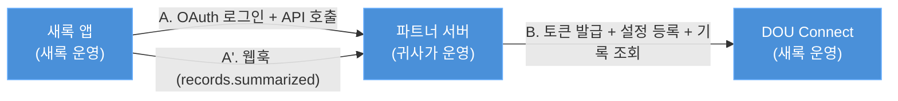
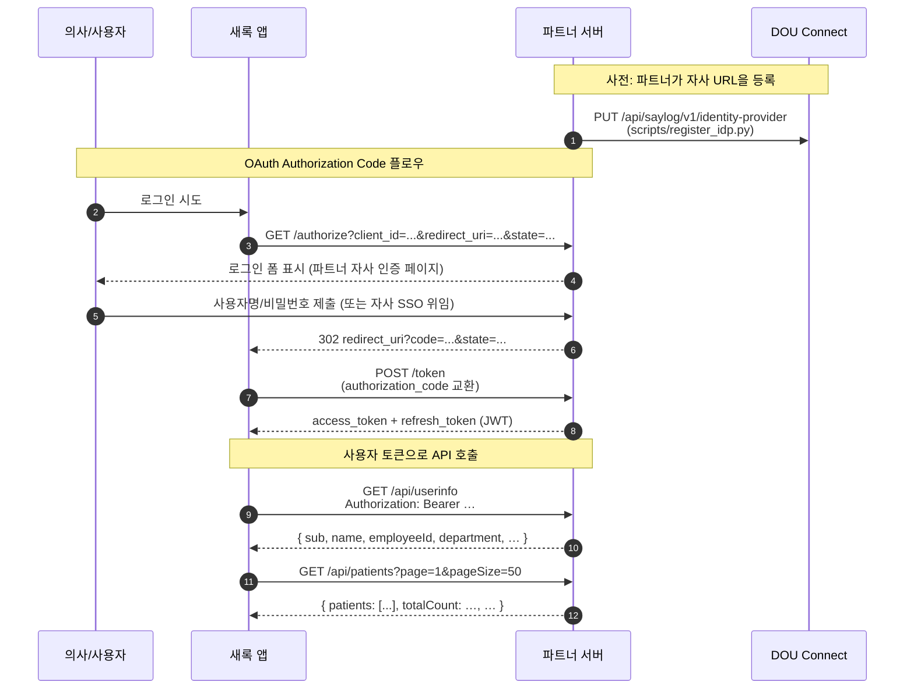
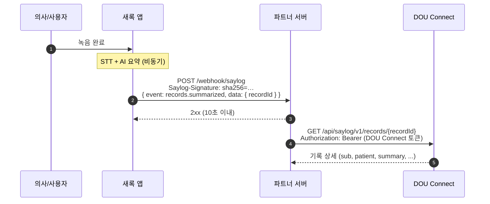

# DOU Connect 새록(Saylog) 파트너 연동 샘플

> [!IMPORTANT]
> **본 샘플은 연동 흐름을 보여주고 학습하기 위한 예제 코드입니다. 이 코드 자체를 실제 서비스에 배포하지 말고, 구현 방식만 참고하세요.**
> 보안·데이터 저장·운영 안정성은 일부러 단순하게 만들어서 **실제 서비스에 그대로 쓸 수 있는 수준이 아닙니다**. 자사 시스템은 자사 보안 기준에 맞춰 직접 구현하시기 바라며, **본 샘플 사용에 따른 보안·운영 사고는 사용 측 책임**입니다. 교체해야 하는 부분은 [§8 보안 단순화 항목](#8-보안-단순화-항목)를 참고하세요. (MIT 라이선스: [LICENSE](LICENSE))

[새록](https://connect.dou.so)은 진료 녹음을 자동으로 STT/AI 요약하는 서비스입니다. 파트너사가 자사 EHR/HIS 시스템과 새록을 연동하려면 OAuth 2.0 인증 서버와 몇 가지 API를 구현해야 하는데, 이 레포는 **그 구현 전체를 작동하는 코드로 보여주는 참고용 샘플**입니다. 파트너사 엔지니어가 직접 띄워 OAuth flow를 끝까지 돌려보고 자사 구현이 맞는지 검증하는 것이 본 프로젝트의 목적입니다.

### 이 샘플이 제공하는 것

- **OAuth 2.0 Authorization Code 서버** — `/authorize`(로그인 폼·302) + `/token`(코드 교환·refresh 회전) + `/.well-known/jwks.json` (RS256 JWT 서명·검증)
- **사용자/환자 조회 API** — `/api/userinfo`, `/api/patients`(페이지네이션) — Bearer 토큰으로 보호
- **웹훅 수신 엔드포인트** — `/webhook/saylog` (HMAC-SHA256 서명 검증, 파트너 선택)
- **DOU Connect 연동 CLI** — IdP 등록·API 스펙 검증·OAuth 자체 검증·웹훅 등록·기록 조회 ([§3.2](#32-운영-cli-b-파트너--dou-connect))
- **로컬 OAuth 데모 스크립트** — 로그인→토큰→API 호출을 한 번에 실행해 흐름 확인 ([§2.3](#23-oauth-플로우-체험))

전체 엔드포인트·CLI 목록은 [§3](#3-샘플이-노출하는-엔드포인트--cli), 디렉토리 구조는 [§4](#4-디렉토리-구조--파일별-책임)를 참고하세요.

> 이 샘플의 의사·환자 데이터는 모두 모킹된 값입니다. 자사 시스템 통합 시 어디를 어떻게 교체해야 하는지는 [§8 보안 단순화 항목](#8-보안-단순화-항목)를 참고하세요.

---

## 목차

1. [연동 개요](#1-연동-개요)
2. [샘플 실행하기](#2-샘플-실행하기)
3. [샘플이 노출하는 엔드포인트 & CLI](#3-샘플이-노출하는-엔드포인트--cli)
4. [디렉토리 구조 & 파일별 책임](#4-디렉토리-구조--파일별-책임)
5. [구현 의무 사항](#5-구현-의무-사항)
6. [환경변수 레퍼런스](#6-환경변수-레퍼런스)
7. [트러블슈팅](#7-트러블슈팅)
8. [보안 단순화 항목](#8-보안-단순화-항목)
9. [참고 문서](#9-참고-문서)

---

## 1. 연동 개요

### 1.1 새록 연동의 두 방향

새록 연동에는 두 가지 트래픽이 흐릅니다. 파트너사가 보는 진입점은 **DOU Connect 게이트웨이 하나**이고, 게이트웨이 뒤의 새록 인프라는 추상화되어 있습니다.



- **A. 새록 → 파트너 (들어오는 트래픽)** — 아래 셋은 파트너사가 **반드시 구현**해야 합니다.
  - OAuth 2.0 Authorization Code 서버 (`/authorize`, `/token`)
  - 사용자 정보 조회 API (`userInfoUrl`)
  - 환자 목록 조회 API (`userPatientsUrl`)
  - 웹훅 수신 엔드포인트 — **파트너 선택**. 녹음 요약 결과를 받아야 할 때만 구현
- **B. 파트너 → DOU Connect (나가는 트래픽)** — 파트너사가 **사전 설정 및 운영용으로 호출**합니다.
  - DOU Connect에서 JWT 발급
  - identity-provider 등록 (위 A 엔드포인트들의 URL을 새록에 알려줌)
  - 파트너 API 스펙 검증
  - 파트너 OAuth flow 시작 (자체 검증용)
  - 웹훅 등록
  - 기록 조회

### 1.2 사용자 로그인 + 환자 조회 흐름

사용자가 새록 앱에서 파트너 OAuth로 로그인하고, 새록이 그 사용자 토큰으로 파트너 API를 호출해 환자 목록을 가져오는 흐름입니다. 사용자당 로그인 시점에 한 번 일어납니다.



### 1.3 녹음 → 웹훅 → 기록 조회 흐름

의사가 녹음을 완료하면 새록이 STT + AI 요약을 비동기로 처리하고, 완료 시점에 파트너 서버로 웹훅을 발송합니다. 파트너 서버는 웹훅의 `recordId`로 기록 단건을 조회해 자사 시스템에 저장하거나 표시합니다. 녹음마다 한 번 일어나며, 위 1.2와 다른 시점에 비동기로 트리거됩니다.



이 샘플은 위 두 흐름의 **모든 단계가 실제로 동작**합니다. 브라우저로 로그인하고, 발급된 토큰으로 API를 호출하고, 웹훅을 시뮬레이션할 수 있습니다.

### 1.4 두 종류의 토큰

B 세그먼트에는 **두 종류**의 토큰이 쓰이며, 서로 자주 혼동되므로 차이를 정리합니다.

| 토큰 | 발급처 | 식별 대상 | 자동 발급? | 사용처 |
|---|---|---|---|---|
| **(A) DOU Connect 토큰** | DOU Connect `/v1/oauth/token` (Client Credentials) | 파트너 클라이언트(회사) | ✅ `client_id`/`client_secret`만 있으면 됨 | 운영 CLI 대부분 — `ConnectClient`가 내부 자동 발급 ([§3.2](#32-운영-cli-b-파트너--dou-connect)) |
| **(B) 파트너 사용자 토큰** | 파트너 OAuth `/token` (Authorization Code) | 파트너에 로그인한 **사용자** | ❌ 브라우저 로그인 필요 | `validate_api.py --partner-user-token` |

- 운영 자동화 스크립트 대부분은 (A)만 다루므로 신경 쓸 게 없습니다.
- **`validate_api.py`만 (B)를 직접 발급해서 전달**해야 합니다 — 파트너 userInfo/patients를 사용자 컨텍스트로 호출해서 응답이 스펙대로 나오는지 검증하기 때문입니다.

---

## 2. 샘플 실행하기

샘플 서버를 띄워 OAuth 흐름을 로컬에서 확인하고(2.1~2.3), 새록(DOU Connect)에 연결해 통합이 도는지 끝까지 돌려보는(2.4~2.10) 단계입니다. 2.1~2.3은 새록 없이 로컬만으로 되고, 2.4부터는 새록 자격증명과 공인 HTTPS(터널)가 필요합니다. **참고용 샘플을 직접 체험하는 흐름**이며, 실제 운영 이관 시 유의점은 [2.12](#212-운영-이관-시-체크리스트)와 [§8 보안 단순화 항목](#8-보안-단순화-항목)을 참고하세요.

### 2.1 의존성 설치

`uv`가 필요합니다 ([설치 가이드](https://docs.astral.sh/uv/getting-started/installation/)).

```bash
git clone <this-repo>
cd dou-connect-sample
uv sync                    # 가상환경 생성 + 의존성 설치
cp .env.example .env       # 환경 변수 템플릿 복사
```

### 2.2 서버 실행

```bash
uv run python -m app
```

> **포트/호스트 변경:** `.env`의 `PORT`, `HOST` 값을 수정하세요. 엔트리포인트는 `app/__main__.py`이며 내부적으로 `uvicorn.run("app.main:get_app", factory=True, reload=True, ...)`를 호출합니다.
>
> **`--factory` 사용 이유:** `Settings`가 필수 환경변수를 강제하므로, 앱 객체는 모듈 import 시점이 아니라 호출 시점에 만들어집니다. 테스트에서는 `.env` 없이도 `Settings`를 직접 주입할 수 있게 됩니다.

### 2.3 OAuth 플로우 체험

샘플 서버로 OAuth 흐름이 도는지 **로컬에서 빠르게 확인**하는 단계입니다. [`scripts/local_oauth_demo.py`](scripts/local_oauth_demo.py)가 로그인 → 토큰 교환 → `userinfo`/`patients` 호출을 한 번에 실행하고 각 단계 응답을 출력합니다. 샘플 서버만 떠 있으면 되고(새록 불필요), base URL·자격증명·`redirect_uri`는 `.env`(`HOST`·`PORT`·`SAYLOG_*`)에서 읽으므로 값을 따로 맞출 필요가 없습니다.

샘플 계정 (시드 데이터, [`app/storage/seed.py`](app/storage/seed.py)):

| 아이디 | 비밀번호 | 역할 |
|--------|----------|------|
| `lee@hospital.com` | `password` | 내과 의사 (사번 12345) |
| `kim@hospital.com` | `password` | 외과 의사 (사번 12346) |

[§2.2](#22-서버-실행)에서 서버를 띄운 상태로, 다른 터미널에서 실행합니다.

```bash
uv run python -m scripts.local_oauth_demo      # 다른 사용자로: --username kim@hospital.com
```

출력 예 (요약):

```
1. code = I7Ln1Try...
2. token 응답: { "access_token": "...", "token_type": "Bearer", "expires_in": 3600, "refresh_token": "...", "scope": "openid profile" }
3. /api/userinfo: { "sub": "user-001", "name": "이의사", "employeeId": "12345", ... }
4. /api/patients: { "patients": [...], "page": 1, "pageSize": 10, "totalCount": 75, "totalPages": 8 }
```

> 스크립트는 브라우저와 달리 302를 따라가지 않고 `Location` 헤더에서 `code`만 빼내므로, `SAYLOG_REDIRECT_URI`가 실제로 도달 가능한 주소가 아니어도 토큰을 받아볼 수 있습니다.

> 이 단계는 새록 없이 로컬에서 토큰까지 빠르게 확인하는 용도입니다. 로그인 폼·리다이렉트를 사람이 직접 브라우저로 체험하는 건 새록 경유 라운드트립이라 [2.8](#28-oauth-flow-브라우저로-체험)에서 다룹니다.

> 운영에서는 인증 코드(`code`)와 토큰 교환을 **새록(DOU Connect)이 처리**합니다 — 파트너가 직접 만지는 값이 아닙니다. 위에서 code를 잡아 토큰을 교환하는 건 로컬 확인용이고, 새록 경유 API 스펙 검증은 [2.7](#27-api-스펙-검증해보기)에서 합니다.

> 여기까지(2.1~2.3)는 새록 없이 로컬만으로 됩니다. **아래 2.4부터는 새록 자격증명과 공인 HTTPS(터널)가 필요**하며, 샘플을 새록에 실제로 연결해 통합이 도는지 돌려봅니다.

### 2.4 새록 자격 증명 발급

1. DOU Connect 포털에서 파트너 계정 생성
2. API 키(`client_id` / `client_secret`)를 **Live**와 **Test** 양쪽에 대해 발급
   - Test 키로 발급된 JWT는 스테이징으로만 라우팅
   - Live 키로 발급된 JWT는 프로덕션으로만 라우팅
   - 데이터가 완전히 격리됨

`.env` 에 입력:
```
DOU_CONNECT_CLIENT_ID=...
DOU_CONNECT_CLIENT_SECRET=...
DOU_CONNECT_BASE_URL=https://connect.dou.so
DOU_CONNECT_AUDIENCE=saylog                      # 받을 토큰의 대상 서비스
DOU_CONNECT_SCOPE=idp:write,idp:read,webhooks:write,webhooks:read,records:read  # 콤마로 구분 (RFC 6749 §3.3 스페이스로 자동 정규화)
DOU_CONNECT_PROVIDER_CODE=...                    # 요양기관번호 — saylog 등 tenant-required 서비스 토큰 발급 시 필수 (미설정 시 403 access_denied)
```

> **토큰 발급 요청 형식 (RFC 6749 §4.4 Client Credentials Grant):**
> DOU Connect는 [Authorization: Basic 헤더 방식](https://datatracker.ietf.org/doc/html/rfc6749#section-2.3.1)을 권장하며 본 샘플의 [`ConnectClient`](app/connect/client.py)도 이 방식을 사용합니다. Basic 헤더와 본문에 `client_id`/`client_secret`을 **동시에** 보내면 `invalid_request`로 거부됩니다. `audience`(필수)와 `scope`(선택)는 본문에 form-urlencoded로 전송합니다. 토큰은 15분(900초) 유효하며 응답 헤더의 `Cache-Control: no-store`를 준수해서 디스크에 저장하지 마세요.

### 2.5 공인 HTTPS URL 노출 (터널)

> [!WARNING]
> **터널(cloudflared Quick Tunnel 등)은 모킹 데이터로 통합 흐름을 확인하는 _로컬 테스트 전용_ 입니다.** 트래픽이 제3자(Cloudflare) 엣지를 평문으로 경유하므로:
> - **실제 `client_id`/`client_secret`이나 환자 데이터를 넣지 마세요.** `.env.example`의 더미값(`saylog-client` / `replace-with-strong-secret`)으로만 테스트하고, 끝나면 터널을 종료하세요.
> - 운영 노출은 자사 정식 도메인 + 자체 TLS + 네트워크 통제([2.12](#212-운영-이관-시-체크리스트))를 사용하세요.

새록(DOU Connect) 게이트웨이는 등록된 파트너 URL에 대해 **공인 HTTPS + 공인 IP** 만 허용합니다. `localhost`·사설망(`10/8`, `192.168/16` 등)·`*.local`·`*.internal`·평문 HTTP는 등록 시점과 실제 호출 직전(DNS 재확인) 모두에서 거부됩니다. 그래서 다음 단계인 **[2.6](#26-샘플-url을-새록에-등록) 등록에서 `http://localhost:8000`을 넣으면 거부**되고, 그 등록 URL로 새록이 들어오는 검증(2.7)·OAuth 라운드트립(2.8)·웹훅(2.9)도 로컬 주소로는 동작하지 않습니다.

로컬에서 띄운 샘플 서버를 임시 공인 HTTPS로 노출하려면 [cloudflared](https://developers.cloudflare.com/cloudflare-one/connections/connect-apps/install-and-setup/tunnel-guide/local/) Quick Tunnel이 가장 간단합니다 (계정·설정 불필요).

> 터널 생성·URL 주입·종료를 직접 하지 않고 통합 검증과 함께 한 번에 하려면 [2.6](#26-샘플-url을-새록에-등록)의 `e2e --with-tunnel`을 쓰세요. 아래는 터널을 직접 다루고 싶을 때(또는 `register_idp` 등 다른 스크립트와 조합할 때)의 수동 절차입니다.

```bash
# 1. 샘플 서버 실행 (별도 터미널) — 이후 재시작 불필요
uv run python -m app

# 2. cloudflared Quick Tunnel — 실행 시 https://<랜덤>.trycloudflare.com URL 출력 (또 다른 터미널)
brew install cloudflared          # macOS. 그 외: 위 공식 가이드 참고
cloudflared tunnel --url http://localhost:8000

# 3. 받은 URL을 등록 명령 앞에 인라인으로 지정 (.env 수정 없이 2.6 등록)
PUBLIC_BASE_URL=https://<랜덤>.trycloudflare.com uv run python scripts/register_idp.py
```

> **`PUBLIC_BASE_URL`은 등록 스크립트만 읽으므로**(서버 코드는 미사용, [config.py](app/config.py)) 터널 URL이 바뀌어도 **서버 재시작·`.env` 수정 없이** 위 3단계만 다시 실행하면 됩니다. Quick Tunnel URL은 매 실행 바뀌고, 고정 URL이 필요하면 cloudflared Named Tunnel이나 [ngrok](https://ngrok.com/) 등 공인 HTTPS면 무엇이든 됩니다. (`JWT_ISSUER`는 자기 발급·자기 검증이라 터널 테스트에서 바꿀 필요 없음 — 운영 권장값은 [§6 환경변수](#6-환경변수-레퍼런스) 참고.)

### 2.6 샘플 URL을 새록에 등록

샘플 서버를 [2.5](#25-공인-https-url-노출-터널) 터널로 노출한 뒤, `.env`의 `PUBLIC_BASE_URL`을 그 공개 URL로 설정하고 등록합니다.

> **2.3~2.9를 한 번에 돌려보기:** 로컬 자가확인 → 등록 → 새록 경유 검증을 [`scripts/e2e.py`](scripts/e2e.py)가 end-to-end로 실행합니다. 사용자 토큰을 로컬에서 발급해 메모리로 들고 검증까지 넘기므로 사람 개입이 없습니다.
> ```bash
> # 서버를 띄운 상태(2.2)에서, --with-tunnel이 cloudflared까지 자동으로 띄운다:
> uv run python -m scripts.e2e --with-tunnel --with-webhook
> #   1) 로컬 로그인→토큰→환자조회  2) 터널 생성·도달 확인  3) IdP(+웹훅) 등록  4) 새록 경유 스펙 검증
> ```
> `--with-tunnel`은 cloudflared Quick Tunnel을 자식 프로세스로 띄워 그 공인 URL을 등록 base로 쓰고, 외부 도달이 확인되면 진행한 뒤 끝나면 터널을 자동 종료합니다 (URL 복사 불필요). 이미 터널을 직접 띄웠다면 `--with-tunnel` 없이 `PUBLIC_BASE_URL=https://<랜덤>.trycloudflare.com uv run python -m scripts.e2e ...`로 그 URL을 주면 됩니다.
>
> `--skip-validate`로 검증을 건너뛸 수 있고, 웹훅 `secret`은 출력만 하므로 직접 `WEBHOOK_SECRET`에 저장 후 서버를 재시작하세요. 이미 등록된 웹훅이 있으면 재등록은 생략됩니다.

등록만 단독으로 하려면 `register_idp.py`를 그대로 씁니다.

```bash
uv run python scripts/register_idp.py
```

`register_idp`가 내부적으로 호출하는 것 ([`scripts/register_idp.py`](scripts/register_idp.py) 참고):
```http
PUT /api/saylog/v1/identity-provider
{
  "authorizationUrl": "{PUBLIC_BASE_URL}/authorize",
  "tokenUrl":         "{PUBLIC_BASE_URL}/token",
  "userInfoUrl":      "{PUBLIC_BASE_URL}/api/userinfo",
  "userPatientsUrl":  "{PUBLIC_BASE_URL}/api/patients",
  "clientId":         "{SAYLOG_CLIENT_ID}",
  "clientSecret":     "{SAYLOG_CLIENT_SECRET}",
  "scopes":           ["openid", "profile"]
}
```

### 2.7 API 스펙 검증해보기

등록 후 새록이 자사 API에 정상 접근 가능한지 + 응답 스펙이 맞는지 확인:

```bash
# 2.3 데모(또는 브라우저)로 발급한 파트너 OAuth **사용자** 토큰을 넘긴다
# (DOU Connect 클라이언트 토큰이 아니라 사용자 토큰 — §1.4 참조)
uv run python scripts/validate_api.py --partner-user-token <access_token>
```

DOU Connect 게이트웨이가 위 사용자 토큰을 들고 등록된 `userInfoUrl`/`userPatientsUrl`을 호출해서 각 필드의 존재/타입/페이지네이션 정합성을 검사하고 결과 리포트를 돌려줍니다. 응답의 각 필드는 다음 중 하나입니다:

- `status: "ok"` — 검증 통과
- `status: "error"` — 스펙 위반. `message` 필드에 사유
- `status: "skipped"` — optional 필드가 응답에 없거나 null이라 검증 보류. 운영 데이터에 값이 있는 케이스로 재검증 권장

### 2.8 OAuth flow 브라우저로 체험

로그인 폼·리다이렉트를 사람이 직접 눈으로 보고, 새록 라운드트립 전체가 도는지 확인합니다.

```bash
uv run python scripts/start_partner_oauth.py
```

응답으로 받은 `authorizationUrl`을 브라우저로 열어 로그인 → DOU Connect 콜백까지 완주되면 OAuth 통합 동작 확인. 본문 인자 없이 호출되며, DOU Connect 토큰의 `partner_id` claim으로 어느 파트너 흐름인지 자동 식별됩니다.

> **반드시 이 스크립트가 출력한 `authorizationUrl`로 시작해야 합니다.** 새록은 시작 시 발급한 `state`를 저장해두고 콜백에서 그 값을 대조해 **자기가 시작한 흐름인지 검증**합니다(CSRF 방지). 그래서 브라우저에 `state`를 임의로 넣어 `/authorize`를 직접 치면, 로그인은 되더라도 콜백 단계에서 새록이 `유효하지 않은 state` (`OAuth 인증 처리 실패`)로 거부합니다. 새록 없이 로컬에서 토큰까지만 빠르게 확인하려면 [2.3](#23-oauth-플로우-체험)의 데모 스크립트를 쓰세요.

### 2.9 웹훅 등록

```bash
uv run python scripts/register_webhook.py
# 또는 통합 e2e와 한 번에:  uv run python -m scripts.e2e --with-webhook  (2.6)
```

응답에 표시되는 `secret`은 **단 한 번만 노출**됩니다. 즉시 `.env` 의 `WEBHOOK_SECRET` 으로 저장하세요. 분실 시 해당 웹훅 삭제 후 재등록 필요 (삭제에는 `webhooks:delete` scope가 필요하므로 `DOU_CONNECT_SCOPE`에 포함되어 있어야 함).

웹훅 재시도 정책: 응답이 2xx 가 아니거나 10초 내 응답 없으면 **10초 → 30초 → 90초** 간격으로 최대 3회 재시도.

### 2.10 기록 조회

웹훅으로 `records.summarized` 이벤트를 받으면:

```bash
uv run python scripts/fetch_records.py --record-id rec_xxx
```

또는 코드에서 [`ConnectClient.get_record`](app/connect/client.py) 호출.

### 2.11 테스트

```bash
uv run pytest -v          # 79 통합/단위 테스트
uv run ruff check .       # 린트
uv run mypy app scripts   # 타입 체크 (strict)
```

### 2.12 운영 이관 시 체크리스트

> 이 항목들은 **샘플이 아니라 실제 운영 배포** 시 점검할 사항입니다. 샘플 자체는 이를 만족하지 않습니다([§8 보안 단순화 항목](#8-보안-단순화-항목) 참고).

- [ ] HTTPS 강제 (HTTP는 거부 또는 리다이렉트)
- [ ] `/token` 등 인증 엔드포인트에 rate limit 적용
- [ ] `client_secret`, `WEBHOOK_SECRET`, JWT private key는 secret manager 사용
- [ ] 로그에 토큰/secret 노출 차단 (Pydantic `SecretStr` 활용)
- [ ] JWT 키 정기 회전 + `kid` 기반 멀티 키 지원
- [ ] `auth_codes`, `refresh_tokens` 영속 저장소 (DB/Redis)
- [ ] 환자 데이터 접근 감사 로그
- [ ] 헬스체크 엔드포인트 (`/healthz` 추가 권장)
- [ ] 메트릭/트레이싱 (OpenTelemetry)
- [ ] DOU Connect IP 화이트리스트 (포털 안내 참고)

---

## 3. 샘플이 노출하는 엔드포인트 & CLI

샘플은 두 종류의 진입점을 제공합니다. **A. 새록이 호출하는 HTTP 엔드포인트**(샘플 서버가 떠 있는 동안 노출)와 **B. 파트너가 DOU Connect를 호출하는 운영 CLI**입니다. 자세한 스펙은 [§5 구현 의무 사항](#5-구현-의무-사항), 실행·등록·검증 절차는 [§2 샘플 실행하기](#2-샘플-실행하기)를 참고하세요.

### 3.1 샘플 서버 HTTP 엔드포인트 (A. 새록 → 파트너)

`uv run python -m app` 으로 실행 시 노출되는 엔드포인트입니다. 인증 컬럼은 호출 측이 제시해야 하는 자격 증명을 뜻합니다.

| Method & Path | 역할 | 인증 | 구현 |
|---|---|---|---|
| `GET /authorize` | 로그인 폼 표시 (OAuth Authorization Code 시작) | 없음 | [`oauth/router.py:authorize_get`](app/oauth/router.py) |
| `POST /authorize` | 자격 증명 검증 후 `redirect_uri?code=…&state=…` 로 302 | 폼(username/password) | [`oauth/router.py:authorize_post`](app/oauth/router.py) |
| `POST /token` | 코드↔토큰 교환 + refresh 회전 (`authorization_code`/`refresh_token`) | client_id/secret (Basic 헤더 또는 본문) | [`oauth/router.py:token`](app/oauth/router.py) |
| `GET /.well-known/jwks.json` | JWT 공개키(JWKS) 공개 — 새록이 토큰 서명 검증에 사용 | 없음 (공개) | [`oauth/router.py:jwks`](app/oauth/router.py) |
| `GET /api/userinfo` | 토큰 `sub` 사용자 프로필 (sub, name, employeeId, department, …) | Bearer (사용자 토큰) | [`api/router.py:userinfo`](app/api/router.py) |
| `GET /api/patients` | 사용자 담당 환자 목록 (`?page`/`?pageSize` 페이지네이션) | Bearer (사용자 토큰) | [`api/router.py:patients`](app/api/router.py) |
| `POST /webhook/saylog` | `records.summarized` 웹훅 수신 (HMAC-SHA256 서명 검증) — **파트너 선택** | `Saylog-Signature` 헤더 | [`webhook/router.py:receive`](app/webhook/router.py) |

### 3.2 운영 CLI (B. 파트너 → DOU Connect)

`scripts/` 의 CLI는 [`ConnectClient`](app/connect/client.py)로 DOU Connect 게이트웨이를 호출합니다. **DOU Connect 토큰(Client Credentials)은 자동 발급**되므로 대부분 인자 없이 실행됩니다 ([§1.4 두 종류의 토큰](#14-두-종류의-토큰) 참고).

| 스크립트 | 역할 | 주요 인자 | 호출하는 DOU Connect API |
|---|---|---|---|
| [`e2e.py`](scripts/e2e.py) | 통합 e2e: 로컬 자가확인 → 등록 → 새록 경유 검증 | `--with-tunnel`, `--with-webhook`, `--skip-validate` (선택) | 데모 + cloudflared(선택) + `register_idp`(+`register_webhook`) + `validate_partner_api` 묶음 |
| [`register_idp.py`](scripts/register_idp.py) | 자사 OAuth/API URL을 새록에 등록 | (없음, `.env` 기반) | `PUT /api/saylog/v1/identity-provider` |
| [`validate_api.py`](scripts/validate_api.py) | 자사 API 스펙 자동 검증 | `--partner-user-token` (사용자 토큰 필수) | 새록이 등록된 `userInfoUrl`/`userPatientsUrl` 호출 |
| [`start_partner_oauth.py`](scripts/start_partner_oauth.py) | 파트너 OAuth flow 자체 검증 시작 | (없음, `partner_id` claim 자동 식별) | `POST /api/saylog/v1/partner-oauth/start` |
| [`register_webhook.py`](scripts/register_webhook.py) | 웹훅 등록 (`secret` 1회 발급) | `--url` (선택) | `POST /api/saylog/v1/webhooks` |
| [`fetch_records.py`](scripts/fetch_records.py) | 기록 목록/단건 조회 | `--record-id`, `--since`, `--employee-id`, `--patient-uid`, `--limit` | `GET /api/saylog/v1/records[/{id}]` |

---

## 4. 디렉토리 구조 & 파일별 책임

```
app/
├── main.py                  # FastAPI 앱 조립 (get_app 팩토리)
├── config.py                # pydantic-settings Settings + 환경변수
├── dependencies.py          # AppState 구성 (저장소, JWT signer, OAuth service 주입)
│
├── domain/                  # 도메인 모델 — 저장소·프레임워크 비의존
│   ├── user.py              # User dataclass (의사/사용자)
│   ├── patient.py           # Patient + PatientType (inpatient/outpatient/emergency)
│   └── auth.py              # AuthCode, RefreshToken
│
├── storage/                 # 영속성 — Protocol 추상
│   ├── base.py              # UserStore, AuthCodeStore, RefreshTokenStore, PatientStore Protocols
│   ├── memory.py            # InMemoryStore (개발용)
│   └── seed.py              # 의사 2명 + 환자 150명 시드
│
├── oauth/                   # === A. 새록이 OAuth로 호출 ===
│   ├── router.py            # /authorize (GET/POST), /token, /.well-known/jwks.json
│   ├── service.py           # 인증코드 발급, 토큰 교환/회전
│   ├── jwt_signer.py        # RS256 서명, JWKS 직렬화
│   ├── errors.py            # OAuth 표준 에러 코드 (invalid_request 등)
│   ├── schemas.py           # TokenResponse, OAuthErrorResponse
│   └── templates/login.html # Jinja2 로그인 폼 (자사 페이지로 교체 가능)
│
├── api/                     # === A. 새록이 Bearer 토큰으로 호출 ===
│   ├── router.py            # /api/userinfo, /api/patients (페이지네이션)
│   ├── dependencies.py      # JWT 검증 의존성
│   └── schemas.py           # UserInfo, PatientDTO, PatientListResponse (camelCase alias)
│
├── webhook/                 # === A. 새록이 records.summarized 전송 ===
│   ├── router.py            # POST /webhook/saylog
│   └── signature.py         # HMAC-SHA256 검증
│
└── connect/                 # === B. 파트너 → DOU Connect ===
    ├── client.py            # ConnectClient (httpx async, 토큰 자동 갱신 + 401 재시도)
    └── schemas.py           # 응답/요청 Pydantic 모델

scripts/
├── local_oauth_demo.py      # === A. 로컬 OAuth flow 데모 (서버를 HTTP로 한 바퀴) ===
│                            # --- 이하 B. 운영 CLI (ConnectClient 사용) ---
├── _common.py               # Settings 로드 + ConnectClient 컨텍스트 매니저
├── e2e.py                   # 통합 e2e: 로컬 자가확인 + 등록(+웹훅) + 새록 경유 검증
├── register_idp.py          # 자사 URL들을 새록에 등록
├── validate_api.py          # 자사 API 스펙 자동 검증 (사용자 토큰 필요)
├── start_partner_oauth.py   # 파트너 OAuth flow 자체 검증 시작
├── register_webhook.py      # 웹훅 등록 (secret 발급)
└── fetch_records.py         # 기록 목록/단건 조회

tests/                       # pytest 통합/단위 테스트 (79개)
docs/superpowers/            # 설계 문서 & 구현 계획 (참고)
```

### 4.1 의존성 방향 (단방향)

```
router(FastAPI)  ──►  service(비즈니스 로직)  ──►  storage(Protocol) ◄── memory(impl)
   │                       │                          ▲
   ▼                       ▼                          │
schemas(DTO)            domain(순수 모델) ────────────┘

connect/client  ◄── scripts/*(운영)
connect/client  ◄── webhook/router(기록 단건 조회)
```

핵심 결정:
- **`domain/`은 어디에도 의존하지 않습니다.** 자사 코드로 그대로 복사 가능.
- **`storage/base.py`의 Protocol을 만족하기만 하면** SQLAlchemy/MongoDB 등 어떤 영속성이든 사용 가능.
- **`oauth/service.py`는 FastAPI에 의존하지 않습니다.** Flask, Django, gRPC 등 어디서든 재사용 가능.

---

## 5. 구현 의무 사항

새록과 정상 연동되려면 아래 스펙을 **반드시** 준수해야 합니다.

### 5.1 OAuth 2.0 Authorization Code Grant

[RFC 6749 §4.1](https://datatracker.ietf.org/doc/html/rfc6749#section-4.1) 표준 그대로 구현합니다.

**`authorizationUrl` 요구사항:**
- 새록이 다음과 같이 리다이렉트합니다.
  ```
  GET {authorizationUrl}?response_type=code&client_id=...&redirect_uri=...&scope=...&state=...
  ```
- 사용자 인증을 완료하면 DOU Connect의 콜백 URL로 302 리다이렉트해야 합니다.
  ```
  https://connect.dou.so/api/saylog/v1/oauth/callback?code={code}&state={state}
  ```
- `state` 값은 **그대로 echo**해야 합니다 (CSRF 방지).
- 인증 코드는 **10분 이내** + **1회용**.

**참고 구현:** [`app/oauth/router.py`](app/oauth/router.py), [`app/oauth/service.py:authorize`](app/oauth/service.py)

**`tokenUrl` 요구사항:**
- `Content-Type: application/x-www-form-urlencoded` 만 받습니다. (본 샘플은 FastAPI `Form`을 쓰므로 다른 content-type은 `422`로 거부됩니다.)
- `grant_type=authorization_code` 와 `grant_type=refresh_token` 둘 다 지원해야 합니다.
- **클라이언트 인증은 [RFC 6749 §2.3.1](https://datatracker.ietf.org/doc/html/rfc6749#section-2.3.1) 에 따라 `Authorization: Basic base64(client_id:client_secret)` 헤더와 본문(`client_id`/`client_secret`) 두 방식 모두 지원**합니다. 두 방식을 동시에 사용하면 `invalid_request`로 거부됩니다.
- 응답 ([RFC 6749 §5.1](https://datatracker.ietf.org/doc/html/rfc6749#section-5.1)): RFC상 부여된 scope가 요청과 다르면 `scope` 반환이 **필수**입니다. 본 샘플은 단순화를 위해 부여된 scope가 비어있지 않으면 항상 반환합니다 ([`oauth/router.py:token`](app/oauth/router.py)).
  ```json
  {
    "access_token": "...",
    "token_type": "Bearer",
    "expires_in": 3600,
    "refresh_token": "...",
    "scope": "openid profile"
  }
  ```
- **Refresh Token Rotation 권장** ([OAuth 2.0 BCP](https://datatracker.ietf.org/doc/html/draft-ietf-oauth-security-topics)). 매 갱신 시 새 refresh_token 발급 + 이전 토큰 무효화.
- 에러 응답 형식 ([RFC 6749 §5.2](https://datatracker.ietf.org/doc/html/rfc6749#section-5.2)):
  ```json
  { "error": "invalid_grant", "error_description": "..." }
  ```
  HTTP 상태와 `error` 코드: `invalid_request`/400, `invalid_grant`/400, `invalid_client`/401, `unsupported_grant_type`/400.

**참고 구현:** [`app/oauth/service.py:exchange_code`, `refresh`](app/oauth/service.py), [`app/oauth/errors.py`](app/oauth/errors.py)

### 5.2 `userInfoUrl` (GET)

**요청:**
```http
GET {userInfoUrl}
Authorization: Bearer {access_token}
```

**응답 (200):**
```json
{
  "sub": "user-001",
  "preferred_username": "lee@hospital.com",
  "name": "이의사",
  "email": "lee@hospital.com",
  "email_verified": true,
  "employeeId": "12345",
  "department": "내과"
}
```

**필수 필드:** `sub`, `preferred_username`, `name`, `employeeId`, `department`
**선택 필드:** `email`, `email_verified`

**에러 상태:** 401 (토큰 무효/만료), 404 (토큰 `sub`에 해당하는 사용자 없음). 자사 구현에서 권한 제어가 필요하면 403을 추가하세요.

**참고 구현:** [`app/api/router.py:userinfo`](app/api/router.py), [`app/api/schemas.py:UserInfo`](app/api/schemas.py)

### 5.3 `userPatientsUrl` (GET, 페이지네이션 필수)

**요청:**
```http
GET {userPatientsUrl}?page=1&pageSize=50
Authorization: Bearer {access_token}
```

토큰의 `sub`로 사용자를 식별하여 해당 사용자가 담당하는 환자 목록만 반환합니다.

**응답 (페이지네이션):**
```json
{
  "patients": [
    {
      "patientUid": "EHR-0003",
      "name": "환자003",
      "attendingPhysician": "김의사",
      "attendingEmployeeId": "12346",
      "patientType": "inpatient",
      "age": "23",
      "isMale": false,
      "department": "외과",
      "ward": "4병동",
      "room": "304",
      "bed": "D",
      "pod": 3,
      "hod": 4
    }
  ],
  "page": 1,
  "pageSize": 50,
  "totalCount": 75,
  "totalPages": 2
}
```

> `totalCount`는 **토큰 사용자가 담당하는 환자 수**입니다. 샘플 시드는 환자 150명을 의사 2명에게 번갈아 배정하므로 의사 1명당 75명이 조회됩니다.

**필수 필드 (환자):** `patientUid`, `name`, `attendingPhysician`, `attendingEmployeeId`, `patientType`
**`patientType` 허용값:** `inpatient` | `outpatient` | `emergency`
**선택 필드:** `age`, `isMale`, `department`, `ward`, `room`, `bed`, `pod` (수술 후 경과일), `hod` (입원 경과일)

**페이지네이션 정합성:**
- `page`/`pageSize`가 **둘 다 없으면** 전체 목록 반환 (페이지네이션 필드 생략 가능).
- **둘 중 하나만** 있으면 `400` (`page and pageSize must be provided together`). 페이지네이션은 쌍으로만 동작합니다.
- 둘 다 있을 때: `totalPages == ceil(totalCount / pageSize)` 반드시 일치.
- 전체 조회와 페이지네이션 조회의 `totalCount`가 같아야 함.

**참고 구현:** [`app/api/router.py:patients`](app/api/router.py)

### 5.4 웹훅 수신 (파트너 선택 사항)

웹훅은 새록이 요구하는 의무가 아니라, **파트너가 녹음 요약 결과를 받아 자사 시스템에 반영하고 싶을 때 쓰는 수단**입니다. 결과 연동이 필요 없다면 구현하지 않아도 됩니다. 녹음 → STT → AI 요약은 비동기로 처리되므로, 결과를 받아야 한다면 폴링보다 웹훅이 편리합니다 — 필요한 경우에만 아래처럼 수신 엔드포인트를 구현하세요.

**검증:**
```http
POST {your_webhook_url}
Content-Type: application/json
Saylog-Signature: sha256=<hex_digest>

{
  "event": "records.summarized",
  "timestamp": "2026-01-01T00:00:00Z",
  "data": { "recordId": "rec_xxx" }
}
```

수신 측은 다음을 수행해야 합니다.
1. body raw bytes 추출
2. 등록 시 발급받은 `secret`으로 HMAC-SHA256 계산
3. `Saylog-Signature` 헤더의 `sha256=` 이후 값과 **상수 시간 비교**
4. 검증 실패 시 401, 성공 시 2xx (10초 이내, 그렇지 않으면 새록이 재시도)

**참고 구현:** [`app/webhook/signature.py`](app/webhook/signature.py), [`app/webhook/router.py`](app/webhook/router.py)

---


## 6. 환경변수 레퍼런스

`.env.example` 을 그대로 복사한 뒤 값만 채워 사용합니다.

| 변수 | 필수 | 기본값 | 설명 |
|------|------|--------|------|
| `HOST` |  | `127.0.0.1` | 서버 바인드 호스트. 외부 노출 시 `0.0.0.0` |
| `PORT` |  | `8000` | 서버 바인드 포트 |
| `PUBLIC_BASE_URL` | ○ | `http://localhost:8000` | 외부에서 도달 가능한 base URL. `register_idp.py`/`register_webhook.py`가 이 값 기반으로 URL 조립. 새록 등록용으로는 **공인 HTTPS** 여야 함 (§2.5 터널 참고) |
| `SAYLOG_CLIENT_ID` | ● | — | 새록 전용 자사 OAuth 클라이언트 ID |
| `SAYLOG_CLIENT_SECRET` | ● | — | 위 클라이언트의 secret |
| `SAYLOG_REDIRECT_URI` | ● | — | DOU Connect 콜백 URL (`https://connect.dou.so/api/saylog/v1/oauth/callback`) |
| `JWT_PRIVATE_KEY_PATH` |  | (자동 생성) | RS256 private key PEM 경로. 비우면 앱 시작 시 자동 생성(개발용) |
| `JWT_PUBLIC_KEY_PATH` |  | (자동 생성) | RS256 public key PEM 경로 |
| `JWT_ISSUER` |  | `http://localhost:8000/oauth` | JWT `iss` 클레임. 프로덕션은 `PUBLIC_BASE_URL`/oauth 권장 |
| `JWT_ACCESS_TOKEN_TTL` |  | `3600` | access token 만료 (초) |
| `JWT_REFRESH_TOKEN_TTL` |  | `2592000` | refresh token 만료 (초, 30일) |
| `DOU_CONNECT_BASE_URL` |  | `https://connect.dou.so` | DOU Connect 게이트웨이 base URL |
| `DOU_CONNECT_CLIENT_ID` | ◐ | — | B 세그먼트(CLI) 사용 시 필수 |
| `DOU_CONNECT_CLIENT_SECRET` | ◐ | — | B 세그먼트(CLI) 사용 시 필수 |
| `DOU_CONNECT_AUDIENCE` |  | `saylog` | 발급받을 토큰의 대상 서비스 (`aud` 클레임에 반영) |
| `DOU_CONNECT_SCOPE` |  | — | 요청 권한 범위 (예: `idp:write,idp:read,webhooks:write,webhooks:read,records:read`). 콤마 구분, 내부에서 RFC 6749 §3.3 스페이스로 정규화. 빈 값이면 본문에서 생략 |
| `DOU_CONNECT_PROVIDER_CODE` | ◐ | — | 요양기관번호(`Hospital.provider_code`). `saylog` 같은 tenant-required 서비스 토큰 발급 시 필수. **미설정 시 토큰 발급이 `403 access_denied`로 거부됨**. 포털 OAuth Client 페이지에서 확인 |
| `WEBHOOK_SECRET` | ◐ | — | `register_webhook.py` 응답에서 받은 값. 웹훅 수신 시 필수 |

`●` = 필수, `○` = 권장 (개발은 기본값 OK), `◐` = 해당 기능 사용 시 필수.

---

## 7. 트러블슈팅

**Q. `uvicorn` 실행 시 `IsADirectoryError: [Errno 21] Is a directory: '.'`**

→ `.env` 의 `JWT_PRIVATE_KEY_PATH=` 처럼 빈 값이 pydantic 에서 `Path("")` (즉 현재 디렉토리)로 해석되던 버그. 최신 코드에서는 빈 문자열 → None 변환 validator 추가됨. `git pull` 후 재시도.

**Q. 새록이 콜백 URL을 받지 못해요.**

→ `SAYLOG_REDIRECT_URI` 가 새록이 보낸 `redirect_uri` 와 **정확히** 일치하는지 확인. DOU Connect 콜백은 고정값입니다:
`https://connect.dou.so/api/saylog/v1/oauth/callback`

**Q. `register_idp.py`가 URL을 거부합니다 (localhost / http / 사설 IP).**

→ 새록은 등록 URL이 **공인 HTTPS + 공인 IP** 여야 합니다. `localhost`·사설망·`*.local`·`*.internal`·평문 HTTP는 거부되고, 도메인이 사설 IP로 resolve돼도 호출 직전에 막힙니다. 로컬 테스트라면 §2.5처럼 cloudflared 등으로 공인 HTTPS URL을 만들어 `PUBLIC_BASE_URL`에 지정하세요.

**Q. JWT 검증이 실패합니다.**

→ 다음을 확인:
- `/.well-known/jwks.json` 이 공개적으로 접근 가능한가 (`curl {PUBLIC_BASE_URL}/.well-known/jwks.json`)
- 토큰의 `kid` 헤더가 JWKS 의 `kid` 와 일치하는가 (`jwt.io` 로 디코딩해서 확인)
- `iss` / `aud` 클레임이 적절한가 (`iss` 는 JWT_ISSUER, `aud` 는 `saylog`)
- 키 자동 생성 모드면 앱 재시작 시 키가 바뀌므로 이전 토큰이 무효화됨 → 고정 PEM 사용

**Q. 토큰 발급은 되는데 API 호출이 401 입니다.**

→ `Authorization: Bearer ` 헤더 앞에 `Bearer ` (대소문자, 공백 1개) 가 맞는지 확인. 또는 토큰이 만료(`exp`)되지 않았는지 확인.

**Q. 페이지네이션 응답에서 `totalPages` 와 `totalCount` / `pageSize` 가 안 맞아요.**

→ `totalPages = ceil(totalCount / pageSize)` 입니다. 정수 나눗셈으로 `total // size` 만 쓰면 안 됨. [`app/api/router.py:patients`](app/api/router.py) 참고.

**Q. 웹훅 서명 검증이 자꾸 실패합니다.**

→ 흔한 실수:
- body 를 JSON parse 후 재직렬화해서 검증하면 공백/필드 순서가 바뀌어 실패. **raw bytes** 그대로 검증해야 함.
- `secret` 의 인코딩 (`.encode()`) 확인.
- `Saylog-Signature` 헤더의 `sha256=` 접두사 처리.

**Q. DOU Connect API 호출 시 401 무한 루프.**

→ `ConnectClient` 는 401 받으면 1회 토큰 강제 재발급 후 재시도합니다 ([`app/connect/client.py`](app/connect/client.py)). 그래도 401이면 `DOU_CONNECT_CLIENT_ID` / `DOU_CONNECT_CLIENT_SECRET` 가 잘못되었거나 비활성 상태일 가능성. 포털에서 확인.

**Q. 토큰 발급에서 `invalid_request`가 옵니다.**

→ DOU Connect는 [Authorization: Basic 헤더] **또는** [본문의 client_id/client_secret] 중 **하나만** 사용해야 합니다. 둘 다 보내면 `invalid_request`로 거부됩니다. 본 샘플 `ConnectClient`는 Basic 헤더 방식을 사용하므로 본문에 자격증명이 함께 들어가지 않도록 주의하세요. 또한 `Content-Type: application/x-www-form-urlencoded` 가 아니면 415 + `invalid_request`가 반환됩니다.

**Q. 토큰 발급에서 `invalid_scope`가 옵니다.**

→ `DOU_CONNECT_SCOPE`에 계약되지 않은 범위를 요청했을 가능성. DOU Connect 포털에서 부여된 scope 목록을 확인하고 그 안에서만 요청하세요. 비워두면 계약된 기본 scope가 자동 부여됩니다.

**Q. `validate_api.py`에 넣을 토큰을 어떻게 발급받나요?**

→ [§2.3](#23-oauth-플로우-체험) 데모 스크립트(`local_oauth_demo.py`)가 출력하는 `access_token`을 `--partner-user-token` 인자로 전달하면 됩니다. 또는 [§2.6](#26-샘플-url을-새록에-등록)의 `e2e.py`가 토큰 발급·검증을 한 번에 처리하므로 직접 다룰 필요가 없습니다. 자사 OAuth로 교체된 production 환경에서는 동일하게 자사 사용자 토큰을 사용.

---

## 8. 보안 단순화 항목

이 샘플이 **의도적으로 단순화한 부분**입니다. 참고 구현이므로 그대로 운영에 쓰면 안 되며, 자사 시스템에서 어떤 부분을 다르게 다뤄야 하는지 확인하는 용도로 봐주세요.

| 항목 | 샘플 동작 | 프로덕션 권장 | 해당 위치 |
|------|----------|--------------|----------|
| 사용자 인증 / 비밀번호 | 평문 비교 | bcrypt·argon2 또는 자사 SSO/LDAP/SAML | [`oauth/service.py:authenticate`](app/oauth/service.py) |
| client_secret 저장 | `.env` | KMS / Secret Manager | `Settings` 로딩 |
| JWT 키 | 자동 생성 (RSA 2048), 재시작 시 교체됨 | HSM 또는 고정 PEM + 정기 회전 + `kid` 멀티 키 | [`oauth/jwt_signer.py`](app/oauth/jwt_signer.py), `JWT_PRIVATE_KEY_PATH` |
| JWT 라이브러리 | `python-jose` (유지보수 정체) | `PyJWT` / `joserfc` | [`oauth/jwt_signer.py`](app/oauth/jwt_signer.py) |
| 인증코드 / refresh token 저장 | in-memory (재시작 시 소실) | DB + 트랜잭션 또는 Redis | [`storage/memory.py`](app/storage/memory.py) |
| 환자 데이터 소스 | in-memory 시드 | EHR/HIS API | [`storage/memory.py`](app/storage/memory.py) |
| HTTPS | 미적용 | 필수 (리버스 프록시 또는 ALB) | 인프라 |
| Rate limit | 없음 | `/token` 등에 적용 (slowapi 등) | 미들웨어 추가 |
| 로그인 폼 | 시드 자격증명이 미리 채워짐 | 자사 디자인/SSO/MFA, 시드 default 제거 | [`oauth/templates/login.html`](app/oauth/templates/login.html) |
| 감사 로그 | 없음 | 환자 데이터 접근 시 사용자/시각/대상 기록 | 미들웨어 또는 service 레이어 |

---

## 9. 참고 문서

DOU Connect 공식 문서:

- **DOU Connect 시작 가이드** — 파트너 자격 발급, 토큰 발급 절차
- **새록 API Reference** — 본 샘플이 구현한 스펙의 원문
  - OAuth 2.0 인증 요청/토큰 교환 표준 항목
  - `userInfoUrl` / `userPatientsUrl` 필드 정의
  - 웹훅 이벤트 (`records.summarized`), 서명 검증 절차, 재시도 정책
  - 기록 조회 (`/api/saylog/v1/records`, `/api/saylog/v1/records/{id}`)

설계·구현 기록 (이 레포):

- `docs/superpowers/specs/2026-05-15-dou-connect-sample-design.md` — 설계 문서
- `docs/superpowers/plans/2026-05-15-dou-connect-sample.md` — Task 단위 구현 계획

표준:

- [RFC 6749 — OAuth 2.0](https://datatracker.ietf.org/doc/html/rfc6749)
- [RFC 7519 — JSON Web Token (JWT)](https://datatracker.ietf.org/doc/html/rfc7519)
- [RFC 7517 — JSON Web Key (JWK)](https://datatracker.ietf.org/doc/html/rfc7517)
- [OpenID Connect Core 1.0](https://openid.net/specs/openid-connect-core-1_0.html) — `sub`, `preferred_username` 등 클레임 정의

---

## 라이선스 / 문의

샘플 코드는 [MIT 라이선스](LICENSE) 아래 배포되며 자유롭게 사내 프로젝트에 복사·수정해 사용하실 수 있습니다. **단, 본 샘플은 "as is"로 제공되며 보안·영속성·운영 적합성에 대한 책임은 사용 측에 있습니다** (LICENSE 참조). 연동 관련 문의: [team@dou.so](mailto:team@dou.so).
